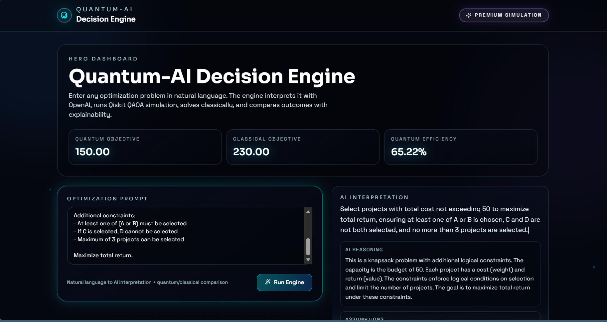
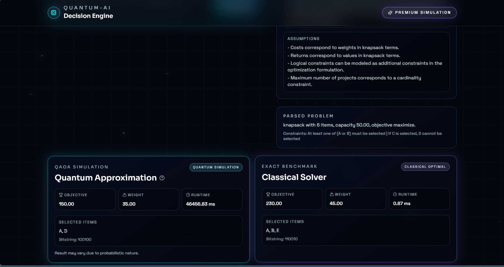
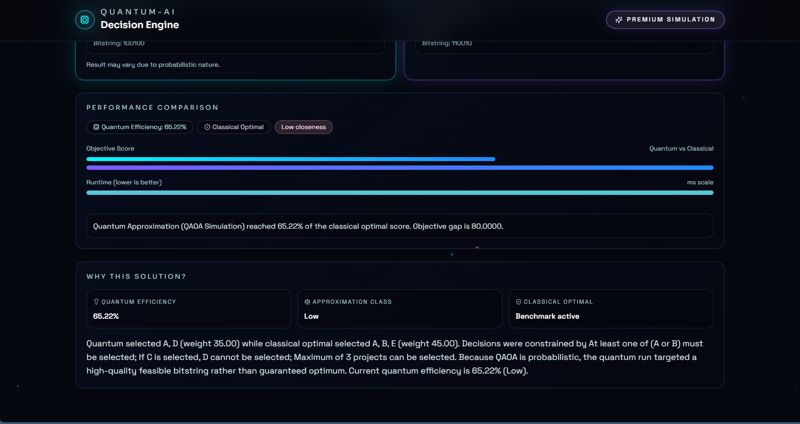

# Quantum-AI Decision Engine

An interactive full-stack decision intelligence platform that turns natural-language optimization problems into structured models, runs OpenAI-powered interpretation, simulates QAOA with Qiskit, solves the same problem classically, and compares both outcomes in a premium recruiter-ready dashboard.

[](https://fastapi.tiangolo.com/)
[](https://react.dev/)
[](https://qiskit.org/)
[](https://platform.openai.com/)

## Why This Project Stands Out

- Converts natural-language optimization requests into strict structured JSON with OpenAI.
- Runs a probabilistic QAOA-style quantum approximation pipeline using Qiskit Aer.
- Benchmarks every run against an exact classical solver.
- Explains why the solution was selected through reasoning, assumptions, and comparison insights.
- Ships with a cinematic futuristic UI built with React, Tailwind CSS, and Framer Motion.

## Product Screens

### Hero Dashboard



### Quantum vs Classical Results



### Performance + Explainability



## Architecture

### Frontend

- React + Vite
- Tailwind CSS
- Framer Motion
- Typed interaction flow for AI interpretation, comparison, and explainability

### Backend

- FastAPI service layer
- OpenAI Responses API with strict JSON schema output
- Qiskit Aer QAOA-style simulation
- Exact brute-force classical optimization baseline

## Core Capabilities

- `/interpret`
  - Accepts natural language as `{ "message": "..." }`
  - Returns validated structured optimization data
- `/solve-quantum`
  - Runs probabilistic quantum approximation
- `/solve-classical`
  - Computes exact optimal solution
- `/compare`
  - Orchestrates interpretation, quantum solving, classical solving, and explainability
- `/health`
  - Returns service health and OpenAI configuration visibility

## Project Structure

```text
Quantum-AI Decision Engine/
  backend/
    app/
      config.py
      main.py
      schemas.py
      services/
        ai_interpreter.py
        classical_solver.py
        comparator.py
        problem_utils.py
        quantum_solver.py
    requirements.txt
    .env.example
  frontend/
    src/
      api/client.js
      components/
        AnimatedBackground.jsx
        ChatOutput.jsx
        ComparisonCard.jsx
        InputBox.jsx
        Loader.jsx
        Navbar.jsx
        WhySolutionPanel.jsx
      App.jsx
      index.css
      main.jsx
    package.json
  docs/
    screenshots/
      dashboard-hero.png
      results-panel.png
      comparison-panel.png
  LICENSE
  README.md
```

## Local Setup

### Backend

```bash
cd backend
python -m venv .venv
.venv\Scripts\activate
pip install -r requirements.txt
```

Create `backend/.env`:

```env
OPENAI_API_KEY=your_key_here
OPENAI_MODEL=gpt-4o-mini
QBRAID_API_KEY=your_qbraid_api_key_here
```

Run:

```bash
uvicorn app.main:app --reload --host 127.0.0.1 --port 8000
```

### Frontend

```bash
cd frontend
npm install
```

Create `frontend/.env`:

```env
VITE_API_URL=http://127.0.0.1:8000
```

Run:

```bash
npm run dev -- --host 127.0.0.1 --port 5173
```

Open `http://127.0.0.1:5173`.

## Example Request

```json
{
  "message": "Choose projects under budget 20. Alpha value 14 and weight 7, Beta value 11 and weight 6, Gamma value 9 and weight 4. Maximize value under constraints."
}
```

## Notes

- OpenAI parsing is strict and does not silently fall back to heuristics.
- Quantum output is probabilistic by design and may vary between runs.
- The current solver pipeline is built for maximize-style knapsack problems.

## GitHub

Repository: <https://github.com/Yuva-raghav/Quantum-AI-Decision-Engine>
